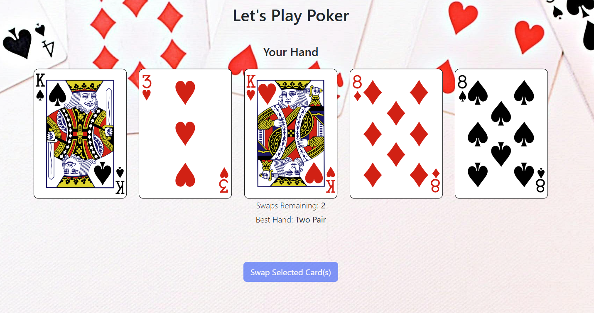
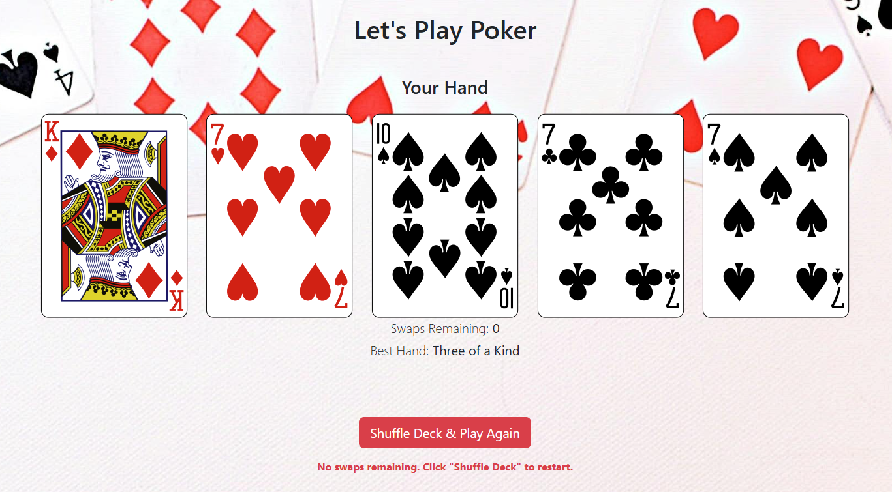

# Poker Hand Analyzer

A simple webapp which displays a hand of 5 cards and determines the best poker hand from the current selection.

## Built With
1. [`Vue.js`](https://vuejs.org/)
2. `HTML`
3. `CSS`
4. [Bootstrap](https://getbootstrap.com/)
5. [Deck of Cards API](https://deckofcardsapi.com/)

## Getting Started
There are **no** dependecies needed - you can simply clone the repository using the command below or download it as a ZIP file, and open the `index.html` file in any browser:

```bash
git clone https://github.com/littl3fo0t/Poker-Hand-Analyzer.git
```
## Usage

On page load, the app makes a fetch request to the Deck of Cards API to generate a new deck and draw 5 cards from it. The cards are displayed to the player along with the best possible poker hand (e.g. Three of a Kind or Flush) with the current selection:


The player can then decide to flip any number of cards facedown and click on the "Swap Selected Card(s)" to discard the flipped cards and draw new cards equal to the number of discarded ones. A new best potential Poker Hand is then calculated. The player can make up to 2 swaps before the game restarts - where the deck will be shuffled and 5 new cards will be drawn:


## Author

Thomas Brun - [@littl3fo0t](https://github.com/littl3fo0t)